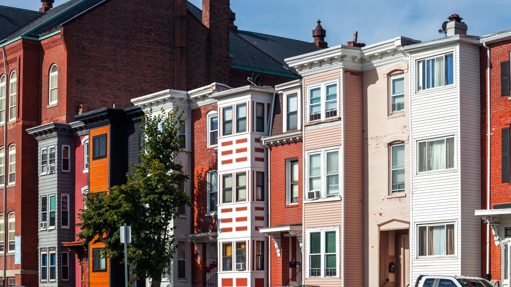
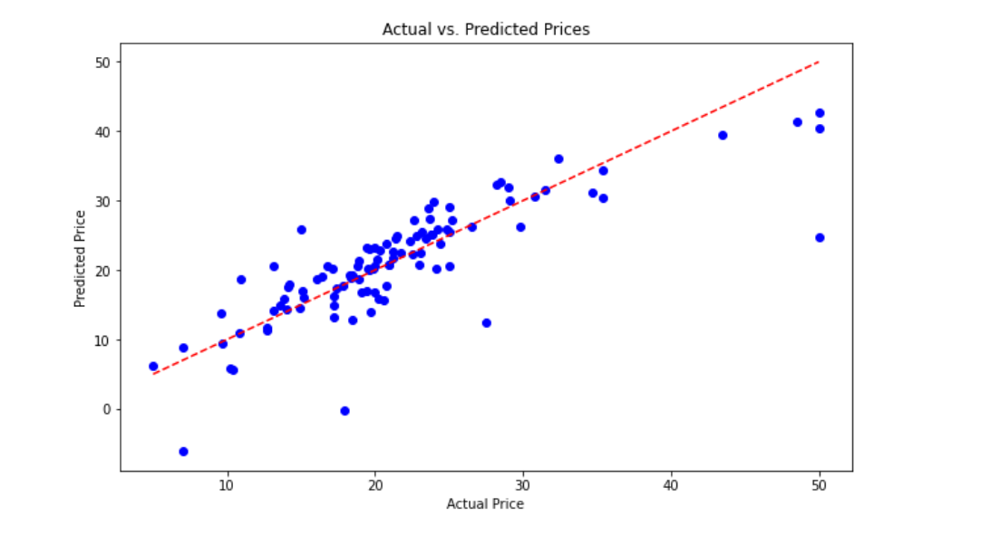
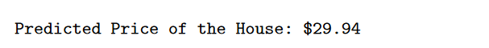

# House Price Prediction Using Linear Regression

Implementation of linear regression using Python to predict the price of houses. Leveraging a [dataset](https://www.kaggle.com/datasets/arunjangir245/boston-housing-dataset/data) sourced from Kaggle, I will be building a predictive model that estimates house prices based on various features such as crime rate, zoning, industrial proportion, proximity to the Charles River, nitrogen oxide concentration, number of rooms, and other factors.



## Dataset Overview

The [dataset](https://www.kaggle.com/datasets/arunjangir245/boston-housing-dataset/data) employed in this project is sourced from [Kaggle](https://www.kaggle.com) and comprises information about housing in the Boston area. It consists of several features including:

- Per capita crime rate
- Proportion of residential land zoned for lots over 25,000 square feet
- Proportion of non-retail business acres per town
- Binary variable indicating proximity to the Charles River
- Concentration of nitrogen oxides in the air
- Average number of rooms per dwelling
- Proportion of owner-occupied units built before 1940
- Weighted distances to Boston employment centers
- Index of accessibility to radial highways
- tax rates
- Median value of owner-occupied homes in thousands of dollars (medv)

## Methodology used


1. Data Loading and Preprocessing- The dataset is loaded into a Pandas DataFrame and preprocessed to handle missing values, by imputing them with the mean of the respective column.

2. Exploratory Data Analysis (EDA)- Initial exploration of the dataset involves examining the first few rows and obtaining datasetinformation. Additionally, data visualization techniques such as pairplots and heatmaps are employed to visualize relationshipsbetween features and their correlations.

3. Model Development- The dataset is split into training and testing sets, and a linear regression model is trained using thetraining data. The model aims to predict house prices based on the available features.

4. Model Evaluation- The performance of the trained model is evaluated using metrics such as Mean Squared Error (MSE) to assess itspredictive accuracy.

5. Visualization of Predictions- The actual versus predicted house prices are visualized to gain insights into the model'sperformance and potential areas for improvement.

6. Prediction of New House Prices- Finally, the trained model is utilized to predict the price of a new house based on its features.

## Reproduction Usage

1. Clone the repository to your local machine and change directory into it.

```sh
git clone https://github.com/stevemats/House_Price_Prediction.git
```

2. Ensure all dependencies are installed. You can install them using pip- pip install -r requirements.txt to avoid any pip issues.

```sh
pip install -r requirements. txt
```

```Python
import numpy as np
import pandas as pd
from sklearn.model_selection import train_test_split
from sklearn.linear_model import LinearRegression
from sklearn.metrics import mean_squared_error
import matplotlib.pyplot as plt
import seaborn as sns

...
```

3. Place your dataset file(e.g., BostonHousing.csv) in the correct path(dataset folder) or spacify the path.

```Python
...

def main():
    # Load the dataset
    file_path = 'dataset/BostonHousing.csv'
    boston = load_dataset(file_path)

...
```

4. Run the main() function to execute the code.



The linear regression model generates raw numerical output to represent the predicted price/value of the house=medv=target variable, then we format that figure to 2 decimal places.

```Python
...


def predict_new_house_price(model, new_house_features):
    """Predict the price of a new house"""
    predicted_price = model.predict(new_house_features)
    formatted_price = "${:,.2f}".format(predicted_price[0])
    print("Predicted Price of the House:", formatted_price)

...
```

#### Output sample


